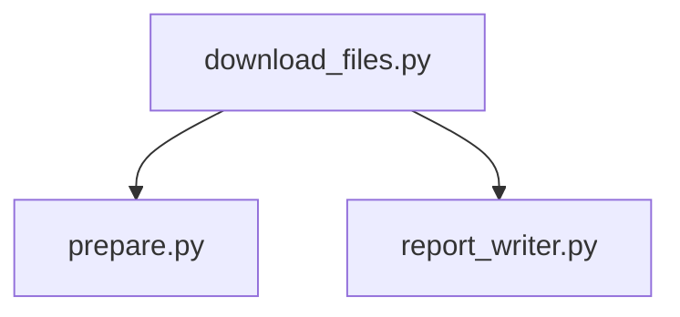

# Test of PDFDownloader
This is a fork of PDFDownloader. It provides unit tests and integration test for all the different function in the project.

PDFDownloader is a modular Python utility designed to streamline the process of preparing, downloading, and reporting on PDF documents sourced from various URLs. It is particularly useful in automated document collection workflows, such as scraping educational resources, reports, or public datasets.

## Features

### PDFDownloader
- Modular design with clear separation of concerns
- URL preparation and parsing from configurable sources
- Robust PDF downloading with error handling
- Automatic report generation summarizing successes and failures
- Easily extensible for different workflows

### Unit tests
- Unit tests for all different functions in the project.
- Unit tests are separated by patching from all external resources.
- Integration tests for all functionality in the project.

## Project Structure

PDFDownloader/

- prepare.py # Gathers and prepares list of PDF links
- download_files.py # Downloads PDFs from prepared list
- report_writer.py # Generates report on download outcome
- test_download.py # Runs unit tests on all functions.
- test_integration.py # Integration tests for all functions
- requirements.txt

## Requirements

- Python 3.8 or later
- Recommended: virtual environment (venv)

**Dependencies**  
(Make sure to install these if not already listed in a `requirements.txt` or just want to install manually)

```bash
pip install requests
```

## Getting Started

1. Clone the Repository

```bash
git clone https://github.com/Marcusvh/PDFDownloader.git
cd PDFDownloader
```

2. (Optional) Create a Virtual Environment

```bash
python -m venv venv
source venv/Scripts/activate
```

3. Install Dependencies

```bash
pip install -r requirements.txt
```

## Usage Guide

```python
python download_files.py
```

It will run all the whole program.

### Flowchart



1. download_files.py creates an instance of prepare.py and call the nessesary functions
2. it then do the same with report_writer.py

prepare.py -> creates and sets paths and opens excel to be read. it also checks for and send info about dublicates.

report_writer.py -> makes (if the files doesn't exist) the csv file for creating the report. it also fills out the report.

download_files -> calls the two other classes, downloads, deletes, summerize the download process. also have simple threading

## TODO

- Cordinate the threadings. right now there is a problem with it sometimes dublicate the last entry of the report
- Check up on the order of downloads
- Actually handle the specific exceptions, instead of just catching them.
- Make the dependency section in readme.
- Update requirements
